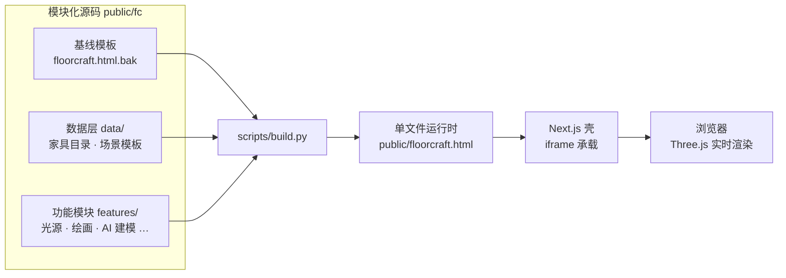

<div align="center">


# FLOORCRAFT · 铺面工坊

**面向咖啡馆 · 联合办公 · 精品零售的 3D 商业空间规划器**

蓝图网格纸质感 — 实时 3D 与平面图双视图 — 从布局推演到图纸交付

<br>

[](https://nextjs.org)
[](https://react.dev)
[](https://threejs.org)
[](https://typescriptlang.org)
[](https://tailwindcss.com)
[](https://prisma.io)

<br>

<sub>无需注册 · 开箱即用 · 全部渲染在浏览器本地完成</sub>

</div>

---

## 这是什么

FLOORCRAFT 把一间 12 × 8 米的商业空间变成一块可以反复推敲的「数字图纸」：
从一张空白平面开始，摆放家具、调整光照、套用品牌色，直到容量核算、消防疏散验证与 PDF 图纸导出，一站式完成。

打开即是蓝图网格纸画布，左侧为家具库，中央为实时 3D 场景，随时一键切换平面图视图。

<br>

## 功能特性

<table>
<tr><td width="50%" valign="top">

**空间设计**

- 实时 3D ↔ 平面图双视图切换
- 8 大场景模板一键起步
- 60+ 件精细建模家具，6 大分类
- 创作工作室：8 种基础形状自由搭建
- 表面绘画：在任意家具表面直接涂色
- 玻璃墙与 6 种窗户系统

</td><td width="50%" valign="top">

**光影与验证**

- 6 种氛围预设：白天 / 黄昏 / 夜晚 / 暖光吧 / 晨光 / 冷调
- 可拖拽点光源与聚光灯
- 程序化木纹材质与环境反射
- 第一 / 第三人称行走验场
- 容量核算与消防疏散验证
- 成本估算与 PDF 图纸导出

</td></tr>
</table>

**场景模板** — 咖啡店 · 联合办公 · 精品零售 · 餐厅 · 烘焙坊 · 独立书店 · 设计工作室 · 小酒馆

**AI 智能建模** — 在创作工作室中上传一张家具图片，经过 5 步分析即可生成可编辑的部件结构，直接载入当前作品。

**人物验场** — 以顾客 / 店员 / 设计师三种身份走进你的设计：
<kbd>W</kbd><kbd>A</kbd><kbd>S</kbd><kbd>D</kbd> 移动 · <kbd>Space</kbd> 跳跃 · 鼠标环顾，切身体会动线与尺度。

<br>

## 快速开始

```bash
# 1 · 克隆并安装依赖（Bun / npm / pnpm 均可）
git clone https://github.com/<your-name>/floorcraft.git
cd floorcraft
bun install

# 2 · 配置环境变量
cp .env.example .env

# 3 · 初始化本地 SQLite 数据库
bun run db:push

# 4 · 启动开发服务器
bun run dev
```

打开 **http://localhost:3000** 即可开始设计。

<details>
<summary>使用 npm / pnpm</summary>

```bash
npm install && npm run db:push && npm run dev
# 或
pnpm install && pnpm db:push && pnpm dev
```

</details>

<br>

## 架构与构建

应用采用「**模块化源码 → 单文件运行时**」的构建策略：
功能与数据以 ES Module 拆分维护，由构建脚本合成一个零依赖、可直接打开的 `floorcraft.html`，再由 Next.js 壳承载。



**想调整家具价格、新增模板或修改功能？** 只需编辑 `public/fc/` 下对应模块，然后重新构建：

```bash
python scripts/build.py
```

<details>
<summary>项目结构</summary>

```
floorcraft/
├── public/
│   ├── floorcraft.html          # 运行时单文件（构建产物，勿手改）
│   ├── floorcraft.html.bak      # 构建基线模板
│   ├── logo.svg                 # 品牌标识
│   └── fc/
│       ├── data/
│       │   ├── catalog.js       #   家具目录：名称 / 价格 / 座位数 / 尺寸
│       │   └── templates.js     #   8 大场景模板（坐标已校核）
│       └── features/            # 功能模块（均含独立文档头）
│           ├── ai-modeling.js       #   AI 智能建模
│           ├── character.js         #   人物操控（第一 / 第三人称）
│           ├── creator-enhance.js   #   创作工作室：形状与材质
│           ├── environment.js       #   墙壁 / 房顶 / 天空
│           ├── furniture-detail.js  #   家具高细节建模
│           ├── glass-walls.js       #   玻璃墙系统
│           ├── lighting.js          #   光源系统与氛围预设
│           ├── painting.js          #   表面绘画
│           └── windows.js           #   窗户系统
├── scripts/
│   ├── build.py                 # 模块化源码 → 单文件运行时
│   └── transform.py             # 源码变换工具
├── src/app/                     # Next.js 壳（iframe 承载运行时）
├── prisma/schema.prisma         # 数据库 Schema
├── db/                          # SQLite 运行时数据（git 忽略）
└── DEPLOY_WINDOWS.md            # Windows 部署指南
```

</details>

<br>

## 技术栈

| 层级 | 技术 | 说明 |
| --- | --- | --- |
| 框架 | Next.js 16 · React 19 · TypeScript | App Router 应用壳 |
| 渲染 | Three.js | WebGL 实时 3D 场景与 2D 平面图 |
| 样式 | Tailwind CSS 4 · shadcn/ui | 组件与设计系统 |
| 数据 | Prisma · SQLite | 本地数据层 |
| 导出 | jsPDF | 图纸 PDF 生成 |
| 构建 | Bun · Python | 依赖管理与运行时合成 |

---

<div align="center">

<sub><strong>FLOORCRAFT · 铺面工坊</strong> — 让每一个商业空间，都值得先在图纸上好好推敲。</sub>

</div>
