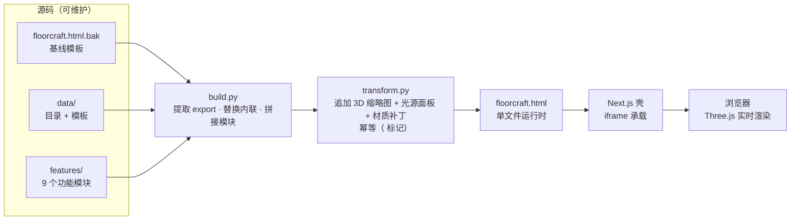

<a href="https://github.com/FANG050829/floorcraft"><p align="center"></p></a>

<p align="center">
  <strong>FLOORCRAFT · 铺面工坊</strong><br>
  <sub>面向咖啡馆 · 联合办公 · 精品零售的 3D 商业空间规划器</sub><br>
  <sub>蓝图网格纸质感 — 实时 3D 与平面图双视图 — 从布局推演到图纸交付</sub>
</p>

<p align="center">

[](https://nextjs.org)
[](https://react.dev)
[](https://threejs.org)
[](https://typescriptlang.org)
[](https://tailwindcss.com)
[](https://prisma.io)

</p>

<p align="center"><sub>全部渲染在浏览器本地完成 · 无需账号 · 数据不出本机</sub></p>

---

## 目录

- [这是什么](#这是什么)
- [功能特性](#功能特性)
  - [家具与场景](#家具与场景)
  - [光影与验场](#光影与验场)
  - [创作工作室](#创作工作室)
  - [AI 智能建模](#ai-智能建模)
- [快速开始](#快速开始)
  - [前置要求](#前置要求)
  - [安装与启动](#安装与启动)
- [架构](#架构)
  - [构建流水线](#构建流水线)
  - [项目结构](#项目结构)
- [维护指南](#维护指南)
  - [更新家具属性](#更新家具属性)
  - [调整场景模板](#调整场景模板)
  - [新增功能模块](#新增功能模块)
- [技术栈](#技术栈)

---

## 这是什么

FLOORCRAFT 把一间 **12 × 8 米**的商业空间变成一块可以反复推敲的「数字蓝图」：
从空白网格纸开始，摆放家具、调整光照、套用品牌色，直到容量核算、消防疏散验证与 PDF 图纸导出，一站式完成。

打开即是蓝图网格纸画布 — 左侧家具库，中央实时 3D 场景，随时一键切换平面图视图。

<p align="center"></p>

## 功能特性

### 家具与场景

**60 件精细建模家具**，按 6 大分类组织，每件含名称、价格、座位数与尺寸：

| 分类 | 数量 | 代表 |
| --- | --- | --- |
| 座位 Seating | 10 | 咖啡椅 · 单人扶手椅 · 高脚凳 · 双人卡座 · 三人沙发 |
| 桌台 Tables | 9 | 双人圆桌 · 四人方桌 · 六人长桌 · 会议桌 · 电动升降桌 |
| 柜台 Counters | 7 | 咖啡吧台 · 甜品展示柜 · 自助水吧 · 收银台 · 前台接待 |
| 货架 Fixtures | 11 | 陈列货架 · 开放书架 · 玻璃高柜 · 饮料冷柜 · 隔音电话亭 |
| 楼梯 Stairs | 4 | 直跑 · L 形 · 旋转 · 悬浮踏步 |
| 陈设 Decor | 19 | 绿植 · 灯具 · 地毯 · 屏风 · 穿衣镜 + 6 种窗户（落地窗 / 拱形 / 圆形 / 百叶 / 飘窗 / 天窗） |

**8 种场景模板** — 坐标已校核避免穿模，一键布置起步：

咖啡店 · 联合办公 · 精品零售 · 餐厅 · 烘焙坊 · 独立书店 · 设计工作室 · 小酒馆

**5 种品牌色预设** — 一键套用到场景的主色点缀：

`#C75B39` 赤陶 · `#2F5D50` 墨绿 · `#31456B` 靛蓝 · `#8A4B6B` 玫紫 · `#B98A2F` 金棕

### 光影与验场

**9 种氛围预设**，一键切换光线基调：

| 预设 | 基调 |
| --- | --- |
| 白天 | 明亮自然光 · 方向性阳光 |
| 晨光 | 柔和晨光 · 低角度斜射 |
| 正午 | 强烈顶光 · 清晰明亮 |
| 黄昏 | 暖橙夕照 · 低角度方向光 |
| 日落 | 低角度夕阳 · 戏剧性暖光 |
| 夜晚 | 冷调月光 · 安静私密的晚间模式 |
| 暖光吧 | 吧台暖光 · 微醺与小聚氛围 |
| 冷调 | 工业冷调 · 现代克制 |
| 黄金时刻 | 黄金时段 · 电影级暖光 |

**可拖拽光源** — 场景中自由放置点光源与聚光灯，实时预览阴影。

**程序化材质** — 家具木纹从 Canvas 噪声生成，金属部件叠加环境反射贴图，无需外部资源。

**人物验场** — 三种身份走进你的设计，切身体会动线与尺度：

| 角色 | 身份 |
| --- | --- |
| 顾客 | 动线与停留时间 |
| 店员 | 服务半径与操作便利 |
| 设计师 | 整体尺度与空间感 |

操作方式：

| 按键 / 操作 | 效果 |
| --- | --- |
| <kbd>W</kbd> <kbd>A</kbd> <kbd>S</kbd> <kbd>D</kbd> | 移动 |
| <kbd>Space</kbd> | 跳跃 |
| 鼠标移动 | 环顾 |
| 相机切换按钮 | 第一 / 第三人称 |
| 灵敏度滑杆 | 鼠标与移动速度 |

**验证与交付** — 容量核算、消防疏散路径可视化、成本估算、一键导出 PDF 图纸。

### 创作工作室

8 种基础形状自由搭建部件，支持材质属性滑杆调节：

方块 · 圆柱 · 圆球 · 圆锥 · 楔形 · 圆环 · 胶囊 · 棱柱

**表面绘画** — 选中家具后，在 3D 视图中直接用鼠标涂抹 / 擦除任意面的颜色，笔触实时更新到 256×256 CanvasTexture。

**玻璃墙系统** — 按模板配置，在指定墙面位置创建透光玻璃面板，木条竖向分割点缀。

### AI 智能建模

在创作工作室左侧栏上传或拖拽一张家具图片，经过 5 步分析（读取图像 → 分析宽高比与构图 → 选择基础形状 → 推断主色与材质 → 组装可编辑模型），即可生成基于基础形状的可编辑部件结构，直接载入当前作品。

---

## 快速开始

### 前置要求

| 工具 | 版本 |
| --- | --- |
| Bun | ≥ 1.0（推荐）· 或 Node.js ≥ 20 + npm / pnpm |
| Python | ≥ 3.9（仅在重新构建 floorcraft.html 时需要） |
| 浏览器 | 最新版 Chrome / Edge / Firefox（需 WebGL 支持） |

### 安装与启动

```bash
# 1. 克隆仓库
git clone https://github.com/FANG050829/floorcraft.git
cd floorcraft

# 2. 安装依赖
bun install

# 3. 配置环境变量
cp .env.example .env

# 4. 初始化本地 SQLite 数据库（首次运行）
bun run db:push

# 5. 启动开发服务器
bun run dev
```

打开 **http://localhost:3000** 即可开始设计。

<details>
<summary>npm / pnpm</summary>

```bash
npm install && npm run db:push && npm run dev
# 或
pnpm install && pnpm db:push && pnpm dev
```

</details>

<details>
<summary>DATABASE_URL 路径说明</summary>

Prisma 的 SQLite 路径基准是 `prisma/schema.prisma` 所在目录。默认值：

```
DATABASE_URL=file:../db/custom.db
```

指向项目根的 `db/custom.db`。如果你想把数据库放在别处，调整相对路径即可。

</details>

---

## 架构

应用采用 **模块化源码 → 单文件运行时** 的构建策略：
功能与数据以 ES Module 拆分维护，由构建脚本合成一个零依赖、可直接打开的 `floorcraft.html`，再由 Next.js 壳通过 iframe 承载。

### 构建流水线



**build.py 的合成策略**：

1. 从 `floorcraft.html.bak` 基线模板中定位内联的 `CATALOG` / `CATS` / `BRAND_PRESETS` 等常量块，整体替换为从 `data/catalog.js` 抽取的 `export` 值
2. 同样方式替换内联 `TEMPLATES` 块为 `data/templates.js` 的导出
3. 将 `features/*.js` 中每个模块的 `export const` / `export function` 拼接到基线末尾
4. 输出统一换行（CRLF / LF 与基线对齐）

**transform.py 的后处理**：

对 build.py 的产物追加 CSS + JS 补丁 — 家具库 3D 实时缩略图、光源控制面板、木纹与金属材质升级。文件头部含 `<!--ENH_V2-->` 标记，重复运行会自动跳过。

### 项目结构

```
floorcraft/
├── index.html                   # GitHub Pages 纯 HTML 演示版入口（带使用提示门）
├── public/
│   ├── floorcraft.html          # 运行时单文件（build.py + transform.py 产物，勿手改）
│   ├── floorcraft.html.bak      # 构建基线模板（build.py 的输入）
│   ├── logo.svg                 # 品牌标识
│   ├── robots.txt
│   └── fc/                      # 模块化源码
│       ├── data/
│       │   ├── catalog.js       #   60 件家具：名称 / 价格 / 座位数 / 尺寸
│       │   └── templates.js     #   8 大场景模板（坐标已校核）
│       └── features/            # 9 个功能模块（均含独立文档头）
│           ├── ai-modeling.js        #   AI 智能建模（比例 / 主色启发式 → 可编辑部件）
│           ├── character.js          #   人物操控（3 种身份 / 第一 + 第三人称）
│           ├── creator-enhance.js    #   创作工作室（形状扩展 + 材质滑杆）
│           ├── environment.js        #   墙壁 / 房顶 / 天空（氛围联动）
│           ├── furniture-detail.js    #   家具高细节建模
│           ├── glass-walls.js        #   玻璃墙（整面 + 木条分割）
│           ├── lighting.js           #   光源系统（9 氛围预设 + 可拖拽光源）
│           ├── painting.js           #   表面绘画（CanvasTexture 笔触）
│           └── windows.js            #   6 种窗户建模 + 2D 平面符号
├── scripts/
│   ├── build.py                 # 模块化源码 → 单文件 floorcraft.html
│   └── transform.py             # 后处理补丁（3D 缩略图 + 光源面板 + 材质升级）
├── src/
│   ├── app/                     # Next.js 壳
│   │   ├── layout.tsx           #   元数据 / 字体
│   │   ├── page.tsx             #   iframe 承载 floorcraft.html
│   │   └── globals.css
│   ├── components/ui/           # shadcn/ui 组件库
│   ├── hooks/
│   └── lib/
├── prisma/
│   └── schema.prisma            # 数据库 Schema
├── db/                          # SQLite 运行时数据（.gitignore）
├── package.json
├── bun.lock
└── DEPLOY_WINDOWS.md            # Windows 部署指南
```

---

## 维护指南

源码与运行时解耦 — 你只需要改 `public/fc/` 下的数据或模块，然后重新构建，不需要碰巨大的单文件 `floorcraft.html`。

### 更新家具属性

编辑 `public/fc/data/catalog.js`，找到对应的家具 key 并修改 `name` / `price` / `seats` / `w` / `d` / `h` 等字段。新增家具只需在 `CATALOG` 对象中追加新条目。

然后重新构建：

```bash
python scripts/build.py
```

### 调整场景模板

编辑 `public/fc/data/templates.js`，修改 `TEMPLATES` 对象中对应场景的 `items` 数组。每个元素是 `{t, x, z, r}` — 类型、X 坐标、Z 坐标、旋转弧度。文件头部有辅助函数 `P` / `c4` / `boothW` / `barSet` 等，用于简洁表达成组家具。

```bash
python scripts/build.py
```

### 新增功能模块

在 `public/fc/features/` 下创建新的 `.js` 文件，头部写文档注释，使用 `export const` / `export function` 导出。build.py 会自动扫描并拼接到运行时。

```bash
python scripts/build.py          # 合成单文件
# 可选：追加 transform.py 补丁（如已应用会自动跳过）
python scripts/transform.py
```

---

## 技术栈

| 层级 | 技术 | 说明 |
| --- | --- | --- |
| 框架 | Next.js 16 · React 19 · TypeScript | App Router 应用壳，iframe 承载运行时 |
| 渲染 | Three.js | WebGL 实时 3D 场景与 2D 平面图 |
| 样式 | Tailwind CSS 4 · shadcn/ui | 组件库与设计系统 |
| 数据 | Prisma · SQLite | 本地数据层（User / Post 模板） |
| 导出 | jsPDF | 图纸 PDF 生成 |
| 构建 | Bun · Python 3 | 依赖管理与模块化源码合成 |

---

<p align="center">
  <sub><strong>FLOORCRAFT · 铺面工坊</strong> — 让每一个商业空间，都值得先在图纸上好好推敲。</sub>
</p>
